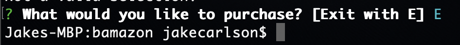

# Bam-azon

This Node.js & MySQL application was built to simulate a virtual store. Once you run the app in terminal/ bash, it will tell you everything you need to know about the store.
* Products for sale
* Department 
* Price
* Quantity 
The app allows you to choose which item you want to buy, how many of that item, and the total cost. 

You're able to shop to your hearts content. Until you buy out the whole store. 

## Instructions
1. After installing the application and the necessary NPMs, type "node bamazonCustomer.js"
   

2. After hitting return, it will display all the inventory available to purchase
      

3. Enter the product that you want to purchase and hit return
   ! [Confirmation Photo](/Buying-iPhone.png)

4. Enter the quantity you would like to purchse
   ! [Quantity Photo](/iPhone-Quantity-Selection.png)

5. You will then see the total cost of your purchase
   ! [Total Cost Photo](/Total-Cost.png)

6. You will notice the inventory levels have changed
   1. Before purchase
        

    2. After purchase
        
   
7. If you try to buy more inventory than is in stock, you will get an error, and have to start over
   

8. When you have finished shopping, hit E to exit the app
   
